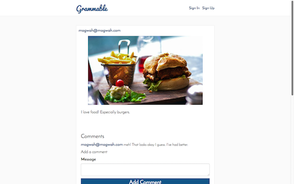

# Grammable

An Instagram clone application that allows users to share photos and comment on them.

Check out the live Grammable application [here](https://grammable-ernie-jamison.herokuapp.com) and add a gram.

### Features:

* Twitter Bootstrap is used for styling the front end.

* Devise is used for user authentication and sign-in forms.

* Image and video storage and delivery utilizes Amazon's S3 Web Services.

* Postgresql provides database services.

